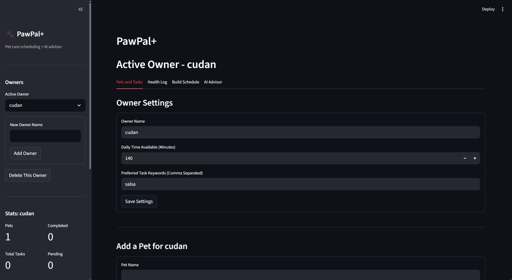
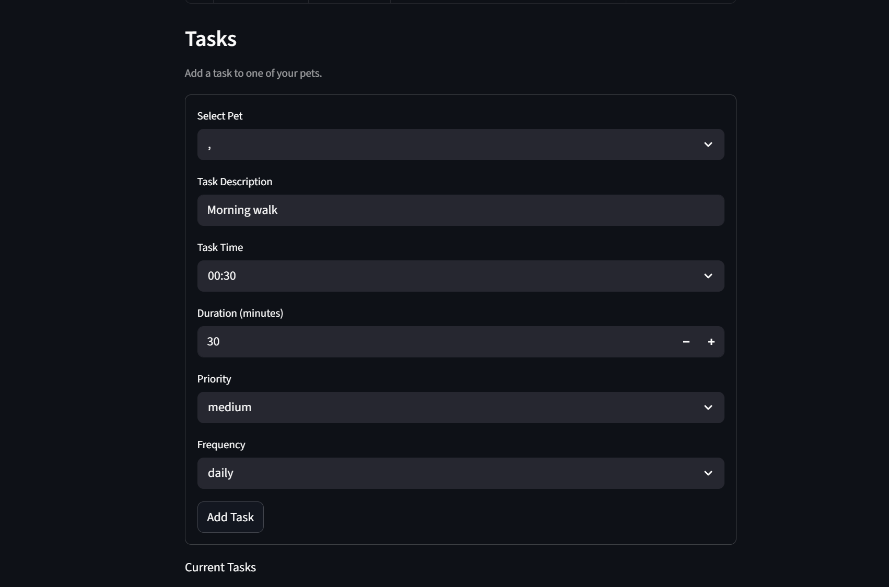
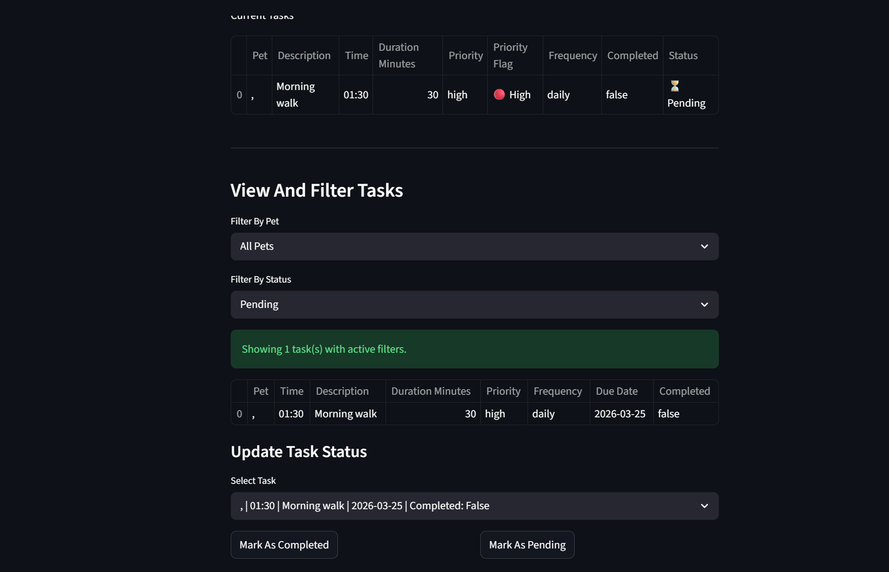

# PawPal+ Applied AI System

## Original Project

**PawPal+** started as a pet care scheduling assistant. The goal was to help a busy pet owner stay on top of daily care tasks without having to track everything manually. It lets you add pets and tasks, build a prioritized daily schedule based on your available time and task urgency, detect when two tasks overlap, and find the next open slot in the day. The system is built in Python with a Streamlit web UI, a JSON persistence layer, and a pytest test suite.

## What Was Added

The app grew in two rounds. First came a set of production-quality features: multi-owner support so different households can each have their own data, a health log per pet to track vaccinations and vet visits, a task completion streak tracker, a stats dashboard in the sidebar, and a schedule export to a downloadable text file.

Then came the centerpiece: a full **agentic RAG (Retrieval-Augmented Generation)** workflow. Instead of just forwarding the schedule to a language model and hoping for decent advice, the system retrieves relevant pet care knowledge from a local vector database first, injects that knowledge into the prompt, and then calls the LLM. The result is grounded, species-specific advice rather than generic suggestions.

## AI Features

### AI Advisor: Agentic RAG Workflow

The pipeline in `ai_advisor.py` runs 9 steps every time you ask a question:

1. Load `GROQ_API_KEY` from the `.env` file.
2. Extract the species present in the owner's pets (dog, cat, bird, rabbit).
3. Build a targeted retrieval query from the species and the user's question.
4. Query a local ChromaDB vector store of 20 curated pet care knowledge documents, filtered by species.
5. Build a plain-text context summary from the owner's pets, tasks, and schedule.
6. Inject the retrieved knowledge chunks into the LLM prompt under a `RETRIEVED KNOWLEDGE:` header.
7. Call the Groq-hosted `llama-3.3-70b-versatile` model with a strict JSON output schema enforced in the system prompt.
8. Run a guardrail that validates JSON keys, confidence range, and flag value before anything reaches the UI.
9. Return a typed `AdvisorResult`, or a safe fallback if the guardrail fires.

This is not a standalone demo. The advisor reads the same live owner and task data that the rest of the app manages.

### RAG Knowledge Base (`rag_knowledge.py`)

- 20 curated pet care documents covering exercise, nutrition, vaccination schedules, dental care, grooming, hygiene, and scheduling best practices
- Species-tagged metadata for dogs, cats, birds, rabbits, and general guidance
- Stored in a persistent ChromaDB vector store in `./chroma_db/` (built on first run, gitignored)
- Uses ChromaDB's built-in embedding function, no PyTorch or Hugging Face dependencies required
- Retrieval is filtered to the owner's species plus general documents so results stay relevant

### Reliability and Guardrails

The `_parse_response()` guardrail in `ai_advisor.py` validates every model response before it reaches the UI. It checks for required JSON keys, a confidence value between 0.0 and 1.0, a valid flag value, and strips markdown fences if the model wraps the JSON in them. A bad response returns a structured fallback with `confidence=0.0` and `flag="incomplete_data"` rather than crashing the app.

The confidence score is shown in the UI so the owner can judge how much weight to give the advice. The retrieved knowledge chunks are displayed in an expandable panel so the owner can see what facts the advice was based on.

## System Architecture

```
 User Input (browser)
        |
        v
+-----------------------------------------------+
|           Streamlit App (app.py)               |
|                                               |
|  Sidebar                                      |
|    Owner switcher, Add/Delete Owner           |
|    Stats: pets, tasks, rate, streaks          |
|                                               |
|  Tab 1: Pets and Tasks                        |
|    Owner Settings (form, explicit save)       |
|    Add Pet / Delete Pet (form-based)          |
|    Add Task (form, time-input, priority)      |
|    Filter by pet / status / priority          |
|    Mark Complete / Mark Pending               |
|            |                                  |
|            v                                  |
|    pawpal_system.py <--> owners.json          |
|    (Owner, Pet, Task, HealthRecord)           |
|                                               |
|  Tab 2: Health Log                            |
|    Add health record per pet                  |
|    View records sorted newest-first           |
|            |                                  |
|            v                                  |
|    pawpal_system.py <--> owners.json          |
|                                               |
|  Tab 3: Build Schedule                        |
|    get_todays_schedule()                      |
|    build_daily_plan()  (priority + budget)    |
|    detect_conflicts()                         |
|    next_available_slot()                      |
|    export_schedule_text() -> .txt download    |
|                                               |
|  Tab 4: AI Advisor                            |
|    User question + owner/pet/task data        |
|            |                                  |
+------------|----------------------------------+
             |
             v
    [ ai_advisor.py ]
    Step 1: load GROQ_API_KEY from .env
    Step 2: extract species from owner data
    Step 3: build retrieval query
             |
             v
    [ rag_knowledge.py ]
    ChromaDB vector store (./chroma_db/)
    20 knowledge docs, cosine similarity
    filter by species + "general"
             |
             v  top-4 retrieved chunks
    Step 5: build owner context string
    Step 6: inject knowledge into prompt
             |
             v
    [ Groq API ]
    llama-3.3-70b-versatile
    system prompt enforces JSON schema
             |
             v
    [ _parse_response() guardrail ]
    validates keys, confidence, flag
    strips markdown fences
             |
        +----+----+
        |         |
      valid    invalid
        |         |
        v         v
  AdvisorResult  safe fallback
  summary        confidence=0.0
  suggestions    flag=incomplete_data
  confidence
  flag
  retrieved_docs
        |
        v
    UI output:
    confidence metric, flag metric
    summary, numbered suggestions
    Retrieved Knowledge expander
    Raw JSON expander
    Advice history (last 3 runs)
```

## Setup Instructions

### Prerequisites

- Python 3.10 or higher
- A free Groq API key from console.groq.com (only needed for the AI Advisor tab)

### Install

```bash
git clone https://github.com/PrajanManojKumarRekha/applied-ai-system-project.git
cd applied-ai-system-project
python -m venv .venv
source .venv/bin/activate      # Windows: .venv\Scripts\activate
pip install -r requirements.txt
```

### Configure the API Key

Open the `.env` file in the project root and replace the placeholder:

```
GROQ_API_KEY=your_groq_api_key_here
```

The app loads this automatically via `python-dotenv`. You never paste it into the UI.

### Run the App

```bash
streamlit run app.py
```

Open the URL printed in the terminal (usually `http://localhost:8501`). On first load the ChromaDB vector store is built from the knowledge documents, which takes a few seconds.

### Run the Tests

```bash
python -m pytest
```

All 32 tests pass. The AI Advisor and RAG tests use mocked clients so no API key or internet connection is needed.

## Sample Interactions

### Example 1: Dog with a consistent schedule

Owner: Jordan, 120 min/day. Pet: Mochi (dog) with morning walk, lunch feed, and a weekly enrichment task.

Question: "Is Mochi getting enough mental stimulation?"

RAG retrieved: dog exercise guidelines, mental enrichment best practices, feeding guidelines.

AI Advisor output:
```
Confidence: 87%
Flag: All Clear

Summary: Mochi has a solid daily routine but mental enrichment appears only weekly.

Suggestions:
1. Add a short puzzle feeder session 3 times a week to increase cognitive engagement.
2. Consider a second shorter walk in the evening to break up long gaps.
3. Rotate enrichment activities so Mochi does not get bored with the same weekly task.
```

### Example 2: Cat with a time conflict and no vet record

Owner: Alex, 60 min/day. Pet: Luna (cat) with two tasks scheduled at 14:00 and no health records.

Question: "Is Luna's schedule missing anything important?"

RAG retrieved: cat vaccination schedule, vet visit importance, litter hygiene guidelines.

AI Advisor output:
```
Confidence: 79%
Flag: Missing Vet Visit

Summary: Luna's schedule has a time conflict at 14:00 and no vet checkup on record.

Suggestions:
1. Shift dental care to 15:00 to resolve the grooming conflict.
2. Add a quarterly vet visit reminder task to keep health records current.
3. Reduce grooming to every two weeks if daily time is limited to 60 minutes.
```

### Example 3: Guardrail catching a bad model response

If the model returns plain text instead of valid JSON, the guardrail intercepts it before anything reaches the user:

```
Confidence: 0%
Flag: Incomplete Data

Summary: The AI advisor could not produce a valid response. Please try again.

Suggestions:
1. Check that your pets and tasks are set up correctly before asking for advice.
```

The guardrail test in the test suite verifies this behavior directly.

## Design Decisions

**Why agentic RAG instead of a plain LLM call?**
A plain LLM call produces advice based on training data that may be outdated or too generic. By retrieving species-specific knowledge before calling the model, the suggestions are grounded in curated, vetted guidelines. The retrieved chunks are visible in the UI so the owner can see exactly what knowledge informed each piece of advice.

**Why ChromaDB with a built-in embedding function?**
ChromaDB runs in-process with no server, keeps the vector store on disk across sessions, and its default embedding function requires no PyTorch or Hugging Face downloads. This keeps the setup to one `pip install` line.

**Why Groq instead of OpenAI or Anthropic?**
Groq provides fast inference for open-weight models at no cost for moderate usage. The model is a parameter in `get_care_advice` so swapping it is one line of code.

**Why structured JSON output?**
Asking the model to return raw text makes the output untestable and unreliable to display. The fixed schema in the system prompt combined with the guardrail in `_parse_response` makes every response testable and safe. A bad response returns a meaningful fallback rather than crashing the app.

**Why confidence scoring?**
The model rates its own confidence from 0.0 to 1.0. A low score usually means the data was too sparse for reliable advice. Showing this to the owner makes the AI's uncertainty visible rather than hiding it behind confident-sounding text.

**Why multi-owner support?**
Real households often have multiple people responsible for different pets. Storing all owners in a single `owners.json` file keeps persistence simple while letting the UI switch context cleanly.

**Why store health records alongside tasks?**
It keeps persistence simple with no external database. The `HealthRecord` dataclass uses the same `to_dict` / `from_dict` pattern as `Task`, so it slots into the existing serialization without new dependencies.

## Testing Summary

32 tests total, all passing.

- **13 tests** cover the core scheduler: task creation and completion, time sorting, priority filtering, conflict detection, daily plan building with time budget constraints, next available slot calculation, JSON persistence round-trip, and edge cases like invalid task times and duplicate pet names.
- **12 tests** cover the AI Advisor: context building with and without pets, JSON parsing for valid and markdown-wrapped responses, guardrail behavior for missing keys and out-of-range confidence, missing API key validation, the `is_safe` property, and end-to-end advice generation with a mocked Groq client.
- **7 tests** cover the RAG layer: species extraction, retrieval query building, verification that retrieved knowledge is injected into the LLM prompt, that `retrieved_docs` is populated on the result, and that empty retrieval is handled without crashing.

The guardrail test specifically confirms that a malformed model response produces a safe fallback with `confidence=0.0` and `flag="incomplete_data"` rather than raising an exception.

One limitation: tests mock both the Groq client and the `retrieve()` function, so real model behavior and actual vector similarity are not exercised in the automated suite. A manual integration test with a live key confirmed end-to-end behavior.

## Reflection

See [reflection.md](reflection.md) for a full reflection on AI collaboration, design decisions, limitations, ethics, and what building this taught about reliable AI systems.

## Demo Screenshots




