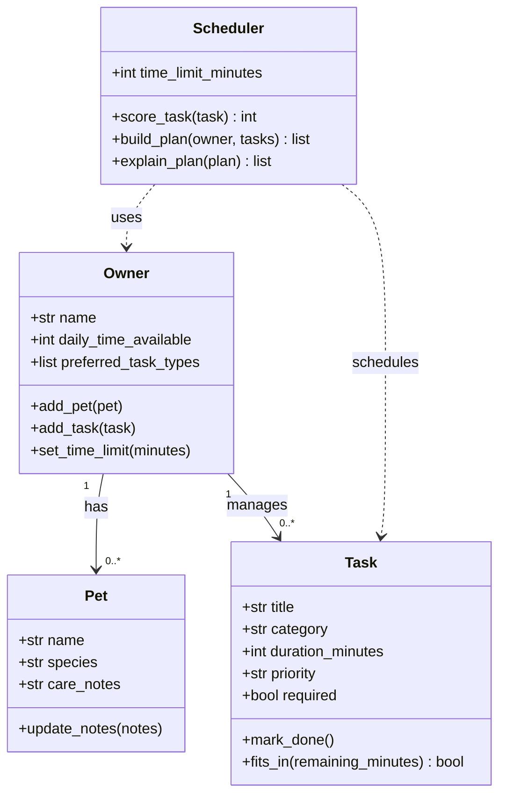

# PawPal+ UML Draft

```mermaid
classDiagram
    class Owner {
        +str name
        +int daily_time_available
        +list preferred_task_types
        +add_pet(pet)
        +add_task(task)
        +set_time_limit(minutes)
    }

    class Pet {
        +str name
        +str species
        +str care_notes
        +update_notes(notes)
    }

    class Task {
        +str title
        +str category
        +int duration_minutes
        +str priority
        +bool required
        +mark_done()
        +fits_in(remaining_minutes) bool
    }

    class Scheduler {
        +int time_limit_minutes
        +score_task(task) int
        +build_plan(owner, tasks) list
        +explain_plan(plan) list
    }

    Owner "1" --> "0..*" Pet : has
    Owner "1" --> "0..*" Task : manages
    Scheduler ..> Owner : uses
    Scheduler ..> Task : schedules
```
